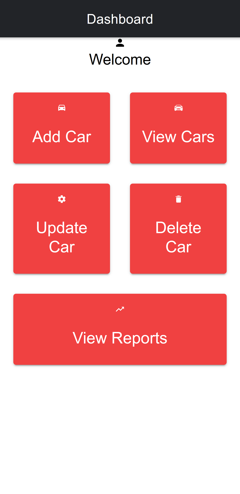
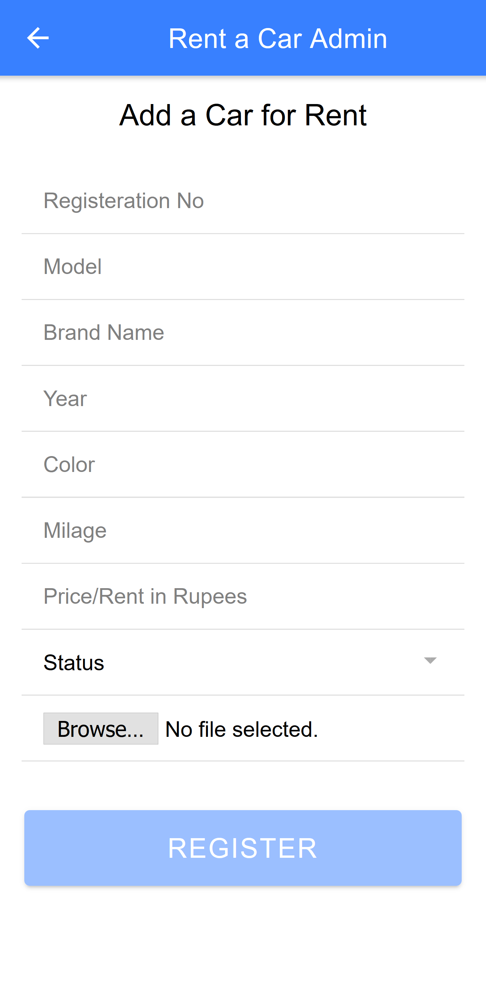

# RAC-admin
A rental car application admin portal
<h1>About App:</h1>

A rental car admin portal which allows you to add, update, delete car, view reports on monthly, weekly, yearly as well as between specific dates
  
<h1>About App:</h1>

In the current version, only add car module is working,  
In the next version i will add the other modules

<h1>FrontEnd</h1>
-> Angular  
-> Html  
-> Css  
-> Ionic Framework  
<h1>BackEnd</h1>
-> Nodejs  
<h1>Database</h1>
-> MongoDB  
 
 
<h1>Frontend Screenshots</h1>
<h2>Admin Dashboard</h2>

<h2>Add Car Page</h2>

<h1>Running Project</h1>
-> git clone or download repository 
-> npm install 
<h2>Thanks!</h2>
